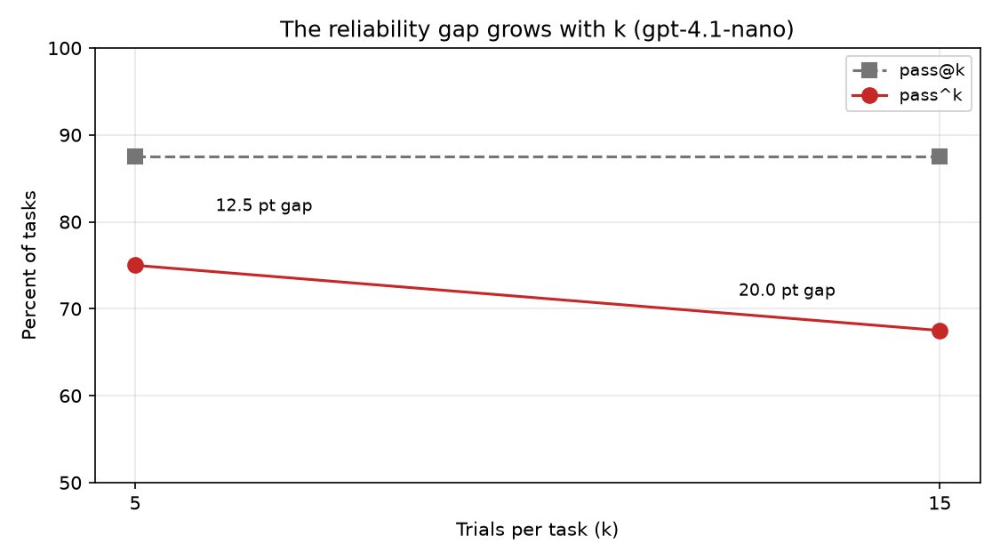
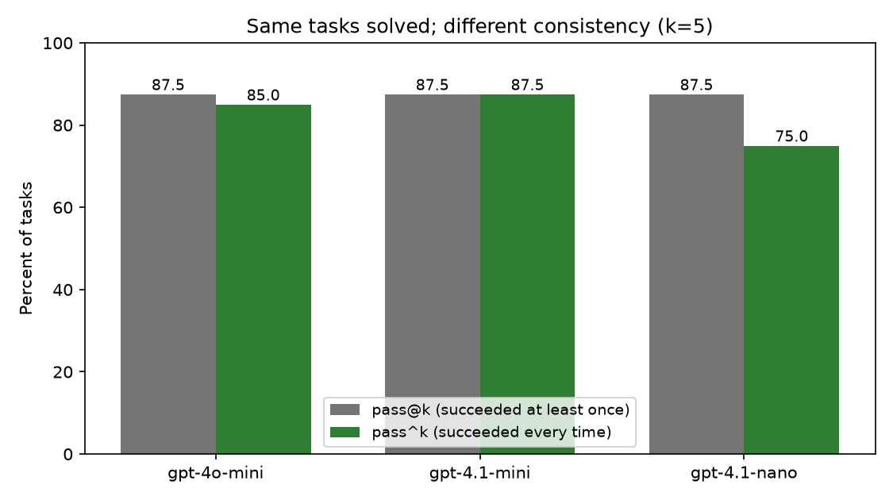
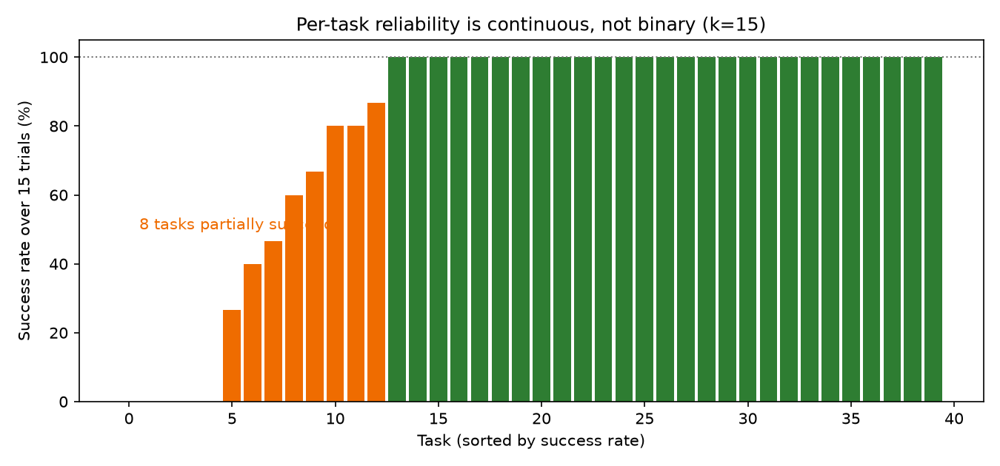
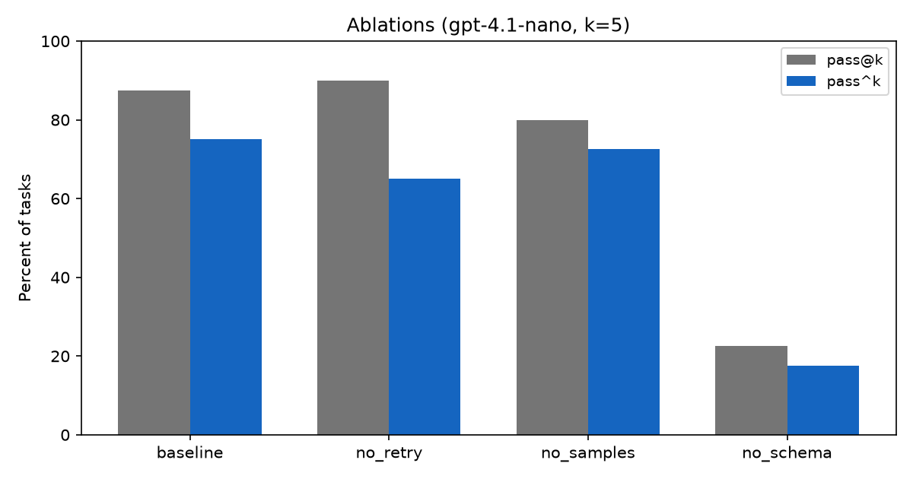

# Agent Reliability Harness

Measuring how *consistently* a text-to-SQL agent succeeds, not just whether it can.

## The problem

Agent benchmarks report **pass@k** — did the agent succeed at least once in k attempts. That is the right metric when a human reviews every output and picks a good one.

Production is not that. A user gets one attempt and no reviewer. What matters is **pass^k** — did the agent succeed on *every* attempt. A task that passes 3 times out of 5 counts as a success under pass@5 and a coin flip in production.

This harness runs an agent repeatedly under deterministic verification and measures the difference.

## Headline results

**The reliability gap grows with k and does not converge.**

| k | pass@k | pass^k | gap |
|---|---|---|---|
| 5 | 87.5% | 75.0% | 12.5 pts |
| 15 | 87.5% | 67.5% | 20.0 pts |

pass@k is stable — the set of solvable tasks does not depend on how many times you ask. pass^k keeps falling, because every additional trial is another chance to observe a failure. Anyone reporting pass^5 is reporting an optimistic number and cannot say how optimistic without more trials.



**All three models solve the same tasks. They differ in consistency.**



**Per-task reliability is continuous, not binary.**



At k=15, eight tasks partially succeed, with rates spread from 27% to 87%. These are not tasks the model can or cannot do — each has its own success probability.

This is why per-task flakiness measured at k=5 is not reproducible. Two independent runs of the identical configuration identified overlapping-but-different flaky sets (two of five overlapped). A task at p=0.87 has roughly a 50% chance of producing five consecutive successes, so it looks perfectly reliable half the time.

**The least reliable tasks are benchmark defects, not model failures.**

Inspecting the four worst tasks by hand found three distinct kinds of defect:

- **t002 (4/15)** — "the conductor that has conducted the most orchestras." All twelve conductors have conducted exactly one. Twelve equally correct answers; the gold query returns whichever row SQLite emits first.
- **t025 (6/15)** — the gold query matches a title ending in `!` that the question omits. Unanswerable without guessing the punctuation.
- **t024 (7/15)** — "maximum and minimum death toll caused each time" admits two valid readings (global vs. per-battle). The agent is inconsistent about which interpretation to commit to, not about SQL.

The bottom of the reliability distribution measures benchmark quality, not agent behaviour — and this is invisible in any aggregate number.

Full analysis, including ablations and problems encountered: [`FINDINGS.md`](FINDINGS.md)

## Ablations

Paired ablations on identical tasks and seeds, one component changed per run.



**Retry reduces variance, not capability.** Without retry, pass@k is slightly *higher* while pass^k drops 10 points and flaky tasks double. The mechanism: 599 of 600 baseline trials ended in successful execution, so retry — which only fires on execution errors — almost never engages. The dominant failure mode is a query that runs cleanly and answers the wrong question, which execution feedback is structurally incapable of detecting.

**Schema access is load-bearing.** Removing it drops trial accuracy from 82.5% to 19.5%, and changes the failure character: the model fails consistently rather than intermittently.

## Method

**Agent.** Receives a question and schema, writes SQL, executes it, and on execution error reads the error and revises. Temperature 0.7 — deliberately nonzero, since at temperature 0 pass^k would trivially equal pass@k.

**Verification.** Deterministic. Execute candidate and gold, compare result multisets. Row order compared only when the gold contains `ORDER BY`; column order ignored; duplicates preserved; numeric strings and numbers compared as numbers. No LLM judge.

**Budget.** Hard per-task caps — 8 model calls, 20K tokens, 120 seconds. Without these, reliability is confounded with how long the agent is allowed to flail.

**Tasks.** 40 Spider dev tasks across 19 databases, fixed seed. Tasks whose gold query returns zero rows are excluded — an agent can match those by writing a query that returns nothing for an unrelated reason.

## Setup

```bash
python3 -m venv .venv && source .venv/bin/activate
pip install -e .
echo 'OPENAI_API_KEY=sk-...' > .env
```

## Reproducing

```bash
python scripts/fetch_spider.py      # dev questions + 20 SQLite databases
python scripts/select_tasks.py      # fixed 40-task subset, seed 20260906
pytest tests/                       # verifier tests

python scripts/run_trials.py --config baseline --trials 5 --run-id v2
python scripts/run_trials.py --config no_retry --models gpt-4.1-nano --trials 5 --run-id v2
python scripts/run_trials.py --config no_samples --models gpt-4.1-nano --trials 5 --run-id v2
python scripts/run_trials.py --config no_schema --models gpt-4.1-nano --trials 5 --run-id v2
python scripts/run_trials.py --config baseline --models gpt-4.1-nano --trials 15 --run-id k15

python scripts/report.py
python scripts/plot_results.py
```

Runs are resumable — re-running an identical command skips completed trials, so a crash or network stall costs nothing. Total cost for all runs reported here was approximately 1.8M tokens, under two dollars.

## Layout

```
FINDINGS.md               full analysis
agent/
  loop.py                 the agent loop; ablations toggle components here
  tools.py                schema inspection and query execution
  verify.py               deterministic result comparison
  budget.py               per-task call, token, and time caps
benchmark/
  reliability.py          pass@k, pass^k, flaky task detection
  store.py                incremental SQLite storage, resumable
scripts/
  fetch_spider.py         download questions and databases
  select_tasks.py         fixed task subset
  run_trials.py           trial runner
  report.py               reliability report
  plot_results.py         figures
tests/
  test_verify.py          verifier tests
docs/                     generated figures
```

## Limitations

**Task difficulty is low.** All three models reach 87.5% pass@k, so they are not separated by capability and the gap is measured near the ceiling. Spider's difficulty labels, or BIRD, would give more room.

**k=15 is still small.** The gap had not converged. Per-task rates carry wide confidence intervals.

**Ablations ran on one model**, so the effects may not generalize across the capability range.

**Single benchmark.** The outcome-validity defects found here are Spider's. The categories — tie ambiguity, missing information, ambiguous phrasing — are generic enough to expect elsewhere, but that is untested.

**One flaky task (t007) is unexplained.** It has the same `ORDER BY ... LIMIT 1` shape as t002 but the data has a clear winner, so tie ambiguity does not account for it. Reported as unexplained rather than assigned a plausible-sounding cause.
